# よく使うソフトウェアをインストール

## プログラミング ➖ Scratch3

Raspberry Piではおすすめソフトをインストールするためのツールが用意されている。

「ラズベリマーク」ー>「設定」ー>「Recommand　Software」の順をクリックすると、「Recommand　Software」が起動される。

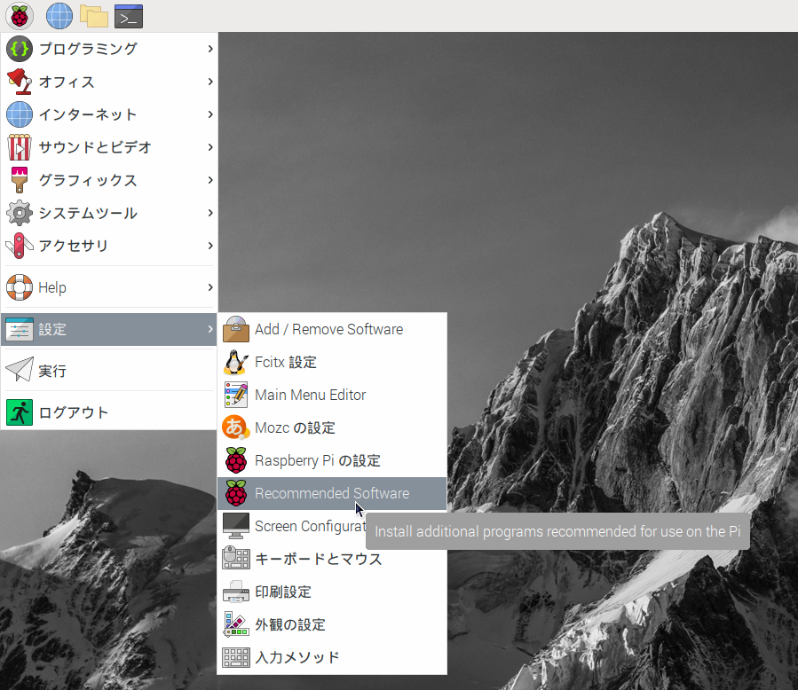


「Recommand　Software」の画面左で「Programming」をクリックし、右側のリストでScratch３のチェックボックスをチェックして、「Apply」ボタンを押すと、Scratch３がインストールされる

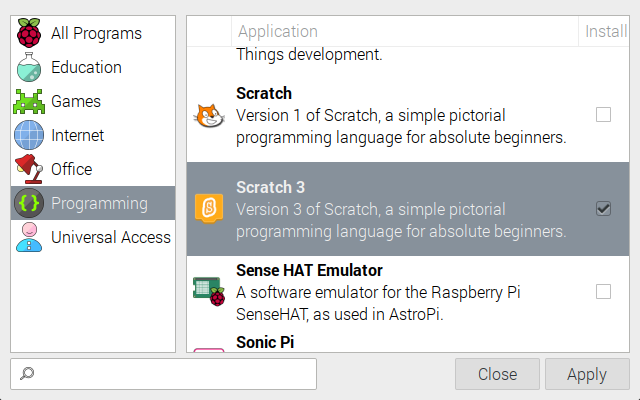

インストールが終わると、メニューの「プログラミング」のところに、「Scratch3」がインストールされる。

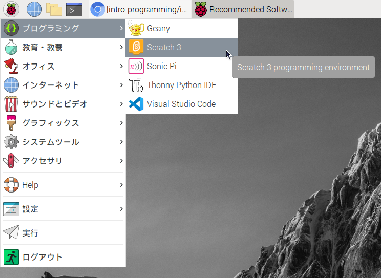

## ワープロ ➖ LibreOffice

Scratch 3と同様にインストールする。

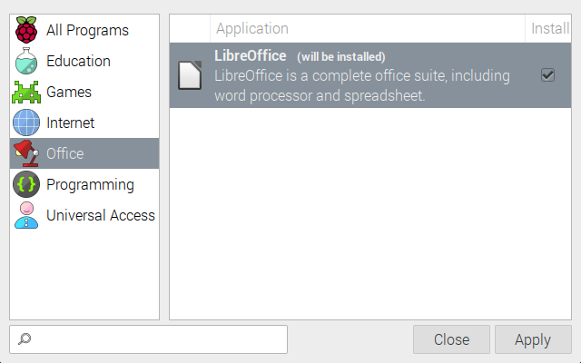

インストールが終わると、メニューの「オフィス」のところに、LibreOfficeのアプリケーションがインストールされる。

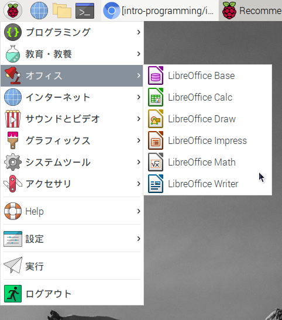

## プログラミング ➖ Visual Studio Code

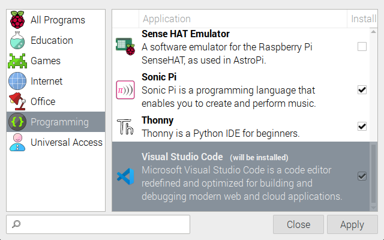

インストールが終わると、メニューの「プログラミング」のところに、「Visual Studio Code」がインストールされる。

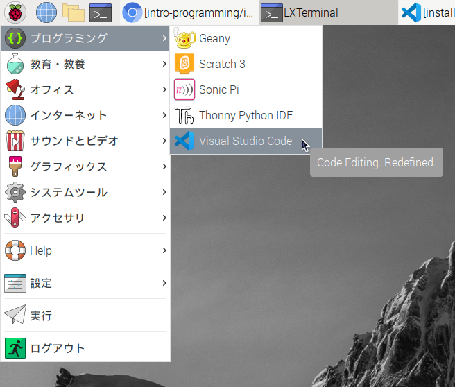

## スクリーンショット ➖ Shutter

スクリーンショットを取るソフトShutterをsnap　storeからインストールする。

ターミナルで以下のコマンドを実行する。

- snap storeをインストール
  ```shell
  sudo apt update
  sudo apt install snapd
  ```
- 再起動
  ```shell
  sudo reboot
  ```
- 最新のsnapを取得
  ```shell
  sudo snap install core
  ```
- shutterをインストールする
  ```shell
  sudo snap install shutter
  ```

## タイピング練習

### 算数タイピング ➖ tuxmath

画面に出ている四則計算の答えを打てゲーム感覚で数値入力の練習ができる。
シェルからインストールする。
```shell
sudo apt install tuxmath
```
実行完了すると、メニュー「教育・教養」の中に「Tux Math」というアプリケーションがインストールされる。


### キータイピング ➖ tuxtype

数値以外のタイピング練習用に`tuxtype`を利用します。
```shell
sudo apt install tuxtype
```
実行完了すると、メニューの「教育・教養」の中に「Tux Typing」というアプリケーションがインストールされる。
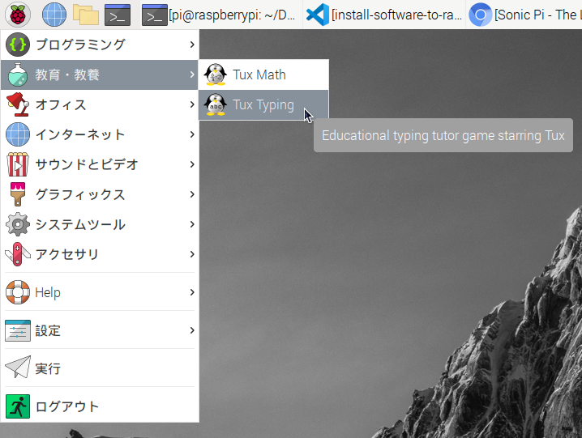

## ライブプログラミング ➖ Sonic Pi

「Recommand　Software」の中にあるSonic Piのバージョンが古く、起動時に失敗するので、最新版を本家ホームページからダウンロードしてインストール。

- 古いバージョンのSonic Piをアンインストールする。
  ``` shell
  sudo apt purge sonic-pi
  ```
- 別のパッケージを残っていないかを確認
  ```shell
  dpkg -l | grep sonic-pi
  ```
  なにか残っていれば、`sudo apt purge xxx`でアンインストールする。
- [本家ホームページ](https://sonic-pi.net/)からパッケージをダウンロードする。
  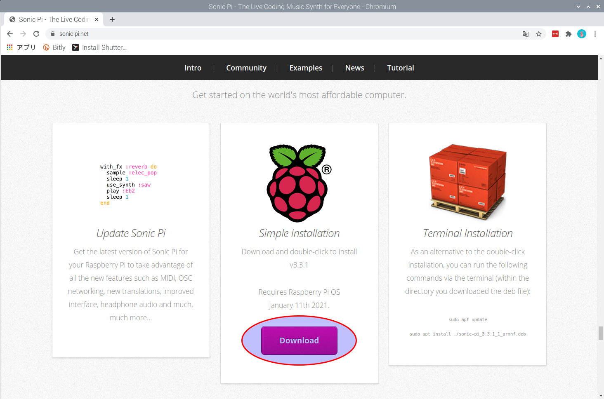
- 「Download」をクリックすると、`sonic-pi_3.3.1_1_armhf.deb`というファイルが自分の「Downloads」フォルダにダウンロードされる。
- インストール
  ```shell
  cd ~/Downloads
  sudo dpkg -i sonic-pi_3.3.1_1_armhf.deb
  ```
  実行が終わると、何か依存されているライブラリがインストールされていない云々が言われるので、言われた通り以下のコマンドを実行する。
  ```shell
  sudo apt --fix-broken install
  ```
  実行完了すると、メニュー「プログラミング」の中に「Sonic Pi」というアプリケーションがインストールされる。
  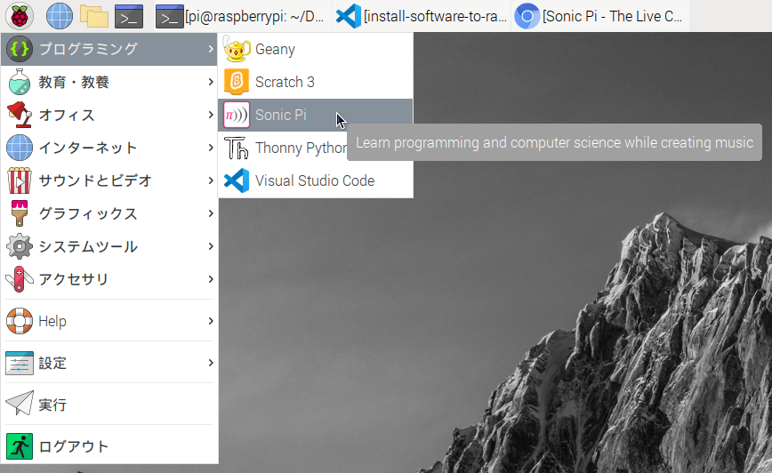
- 上記「Sonic Pi」をクリックすると、アプリケーションが起動される。
  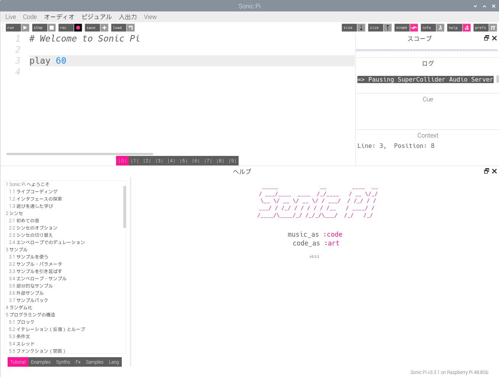

## xdg-utils

```shell
sudo apt install xdg-utils
```

インストールし終わったら、`~/.zshrc` に alias を追加しておく。

```shell
alias open=xdg-open
alias e.="xdg-open ."
```

これで、ターミナルから以下の alias が使えるようになる。
- `open filename`

  関連付けされているアプリでファイルを開く

- `e.`
  ファイルマネージャでカレントディレクトリを開く


## アプリランチャー - Synapse

シェルで以下のコマンドを実行：
```shell
sudo apt update
sudo apt install synapse
```
インストールが終わったら、メニューの「アクセサリ」の中に「Synapse」がインストールされる。

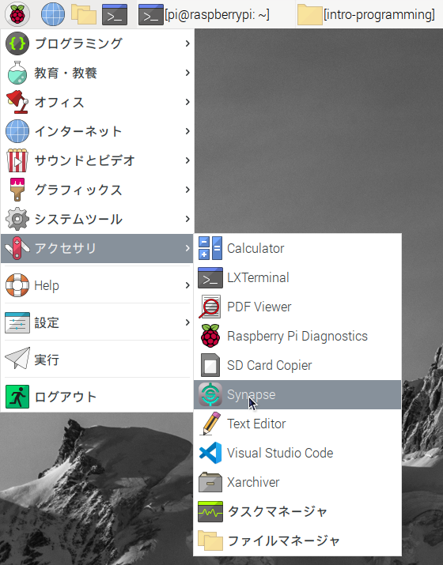

それを起動すると、タスクバーの右側に「Synapse」のアイコンが表示される。
そのアイコン上でマウスを右クリックして設定を選ぶ。

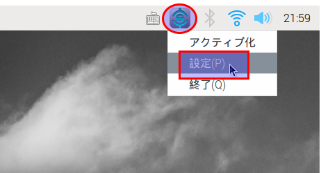

「ログイン時に起動する」をチェックして、「閉じる」を押す。

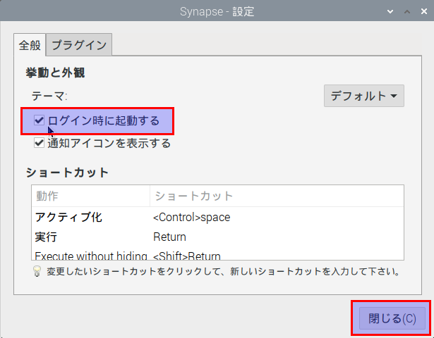

## ブラウザ - firefox

```shell
sudo apt install firefox-esr 
```
実行完了すると、メニューの「インターネット」のところに「Firefox ESR」がインストールされる。

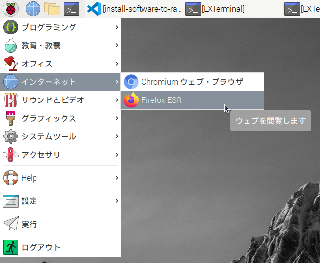

## シェル美化prj

### zsh

- インストール
  ```
  sudo apt install zsh
  ```

- デフォルトシェルをzshにする
  ```shell
  chsh
  ```
  パスワードが聞かれるので、入力してリターン。

  ログインシェルを`/usr/bin/zsh`に設定する。

- システムを再起動
  ```shell
  sudo reboot
  ```

シェルを再起動すると、zshが起動するようになる。

初回起動時に以下のようなメッセージが表示されるので、

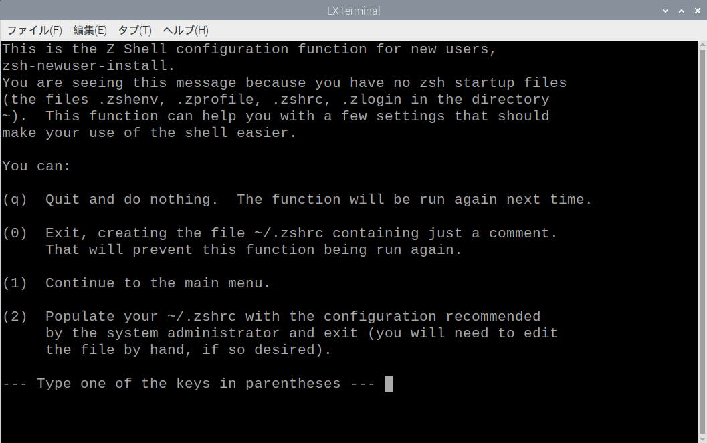

とりあえず「２」を押しておすすめの設定を生成させる。

### Nerd font

- firamonoのNerd fontをダウンロード
  
  `https://github.com/ryanoasis/nerd-fonts/tree/master/patched-fonts/FiraMono/Regular`から`complete`フォルダにあるフォントファイルをダウンロードする。

- ダウンロードしたファイルをフォントのフォルダにコピー
  
  ```shell
  mkdir -p ~/.fonts/furacode
  cd ~/Downloads/
  mv *.otf ~/.fonts/furacode/.

  ```

- フォントのキャッシュを更新
  ```shell
  fc-cache
  ```
- LXterminalのフォントをNerd Fontに設定する。
  
  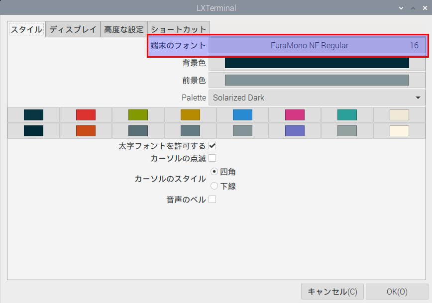


### zシェルプラグインマネージャー[zplug](https://github.com/zplug/zplug)

- zplugをインストール
  ```shell
  export ZPLUG_HOME=~/.zplug
  git clone https://github.com/zplug/zplug $ZPLUG_HOME
  ```
- `.zshrc`を編集
  ```bash
  # zplug settings
  export ZPLUG_HOME=~/.zplug
  # git clone https://github.com/zplug/zplug $ZPLUG_HOME
  source $ZPLUG_HOME/init.zsh

  # cdを強化する
  # https://github.com/b4b4r07/enhancd
  zplug "b4b4r07/enhancd", use:init.sh

  # Vanilla shell
  zplug "yous/vanilli.sh"

  # 補完の強化
  zplug "zsh-users/zsh-completions"

  # 履歴補完の強化
  zplug "zsh-users/zsh-autosuggestions"

  # タスクを非同期で実行できるようにする
  zplug "mafredri/zsh-async", from:github

  # テーマ
  zplug "bhilburn/powerlevel9k", use:powerlevel9k.zsh-theme, as:theme
    POWERLEVEL9K_LEFT_PROMPT_ELEMENTS=(dir newline vcs) # 2行表示
    plugins=(virtualenv)
    POWERLEVEL9K_RIGHT_PROMPT_ELEMENTS=(status virtualenv) # 右側にPython仮想環境
    # ターミナルのフォントをnerd-fontに設定してから、下の行を追加
    POWERLEVEL9K_MODE='nerdfont-complete'

  # コマンドをハイライトしてくれる
  zplug "zsh-users/zsh-syntax-highlighting"

  # Install plugins if there are plugins that have not been installed
  if ! zplug check --verbose; then
      printf "Install? [y/N]: "
      if read -q; then
          echo; zplug install
      fi
  fi

  # Then, source plugins and add commands to $PATH
  zplug load # --verbose


  #####################################################
  ################# ここから下はzshの設定 ################
  #####################################################

  # 入力した文字から始まるコマンドを履歴から検索し、上下矢印で補完
  # 鍵盤コードは`bat /etc/zshrc`で確認
  autoload -U up-line-or-beginning-search
  autoload -U down-line-or-beginning-search
  zle -N up-line-or-beginning-search
  zle -N down-line-or-beginning-search
  bindkey "$terminfo[kcuu1]" up-line-or-beginning-search
  bindkey "$terminfo[kcud1]" down-line-or-beginning-search

  # Beep音をなくす
  setopt no_beep

  # 履歴関連設定
  setopt share_history # 他のzshと履歴を共有
  setopt hist_ignore_all_dups # 同じコマンドをヒストリに保存しない
  setopt hist_reduce_blanks # 無駄なスペースを消してヒストリに保存する

  # 選択されたテキストの背景色を変更し、ハイライトする
  zstyle ':completion:*:default' menu select=2

  # パスを直接入力してもcdする
  setopt AUTO_CD

  # 環境変数を補完
  setopt AUTO_PARAM_KEYS

  # Add color to ls command
  export CLICOLOR=1

  export LANG=ja_JP.UTF-8
  export LC_ALL='ja_JP.UTF-8'

  alias ...="cd ../../"
  alias cls="clear"
  alias gpl="git pull"
  alias pull="git pull"
  alias gps="git push"
  alias push="git push"
  alias gst="git status"
  alias gs="git status -s -b -u"
  alias status="git status"
  alias gco="git commit"
  alias commit="git commit"
  alias add="git add"
  ```
### `ls`よりちょっと美しい[exa](https://github.com/ogham/exa)をインストール

- `exa`をインストール
  
  IntelやAMD、Arm64のマシンでは`lsd`を使っているが、Raspberry Piで簡単にインストールできなかったので、代わりに[exa](https://github.com/ogham/exa)を使うようにする。

  ```shell
  sudo apt install exa
  ```

  `ls`との比較：

  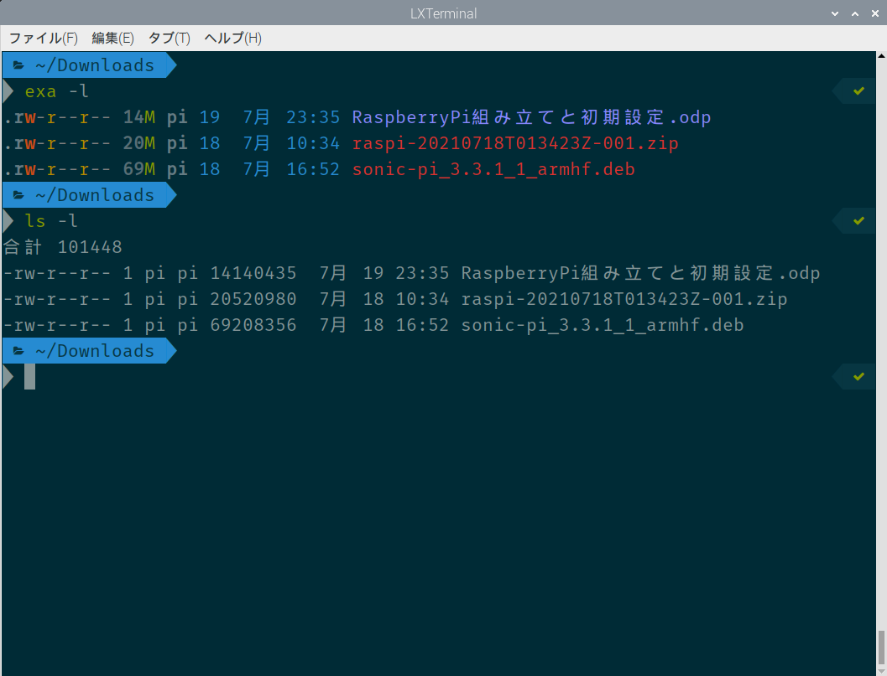

- ls の alias を設定
  ~/.zshrc に以下の内容を追加して、`source ~/.zshrc`で適用する。
  ```bash
  # sudo apt install exa
  alias ls=exa
  alias la="exa -a"
  alias ll="exa -algh --time-style iso"
  alias lt="exa -alghT -I .git --time-style iso"
  alias lg="exa -algh --git --time-style iso"
  alias ltg="exa -alghT --git -I .git --time-style iso"
  ```

### peco

- peco をインストール
  
  ```shell
  sudo apt install peco
  ```

- pecoによる過去コマンドの検索
  
  `~/.zshrc` に以下を追加
  ```shell
  function peco_select_history() {
    local tac
    if which tac > /dev/null; then
      tac="tac"
    else
      tac="tail -r"
    fi
    BUFFER=$(fc -l -n 1 | eval $tac | peco --query "$LBUFFER")
    CURSOR=$#BUFFER
    zle clear-screen
  }
  zle -N peco_select_history
  bindkey "^R" peco_select_history
  ```

  これで、ターミナルで「Ctrl + R」を押して、過去のコマンドを検索できるようになる。

  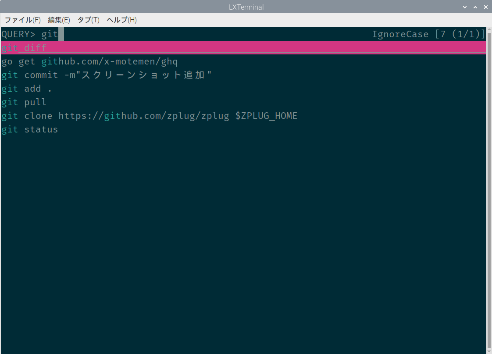

### gitリポジトリ管理 - ghq

- go言語をインストールする
  
  ```shell
  sudo snap install go
  ```
- ghq をインストール
  
  ```shell
  go get github.com/x-motemen/ghq
  ```

  インストールが終わったら、`~/.zshrc`にPATHを追加する。

  ```shell
  export PATH="$PATH:$HOME/go/bin"
  ```

  追加したら、ターミナルで`source ~/.zshrc`を実行して反映させる。

  ```shell
  $ ghq --version
  ghq version 1.2.1 (rev:HEAD)
  ```

- `~/.zshrc`に設定を追加
  ```shell
  function peco-src () {
    local selected_dir=$(ghq list -p | peco --query "$LBUFFER")
    if [ -n "$selected_dir" ]; then
      BUFFER="cd ${selected_dir}"
      zle accept-line
    fi
    zle clear-screen
  }
  zle -N peco-src
  bindkey "^G" peco-src
  ```

- ghq と peco による git リポジトリ管理
  
  gitリポジトリを取得：￥するには、

  ```shell
  ghq get $url
  ```

  git リポジトリのフォルダに移動するには、ターミナルで「Ctrl + G」を押して、該当リポジトリ選んで「Enter」を押す。
  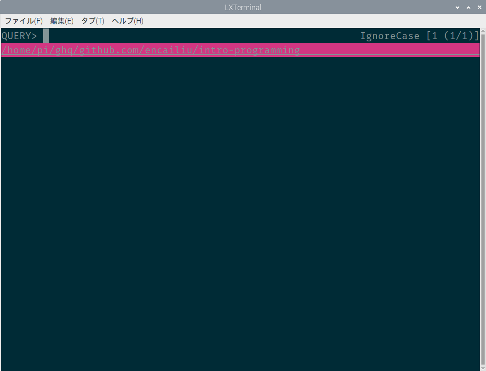

