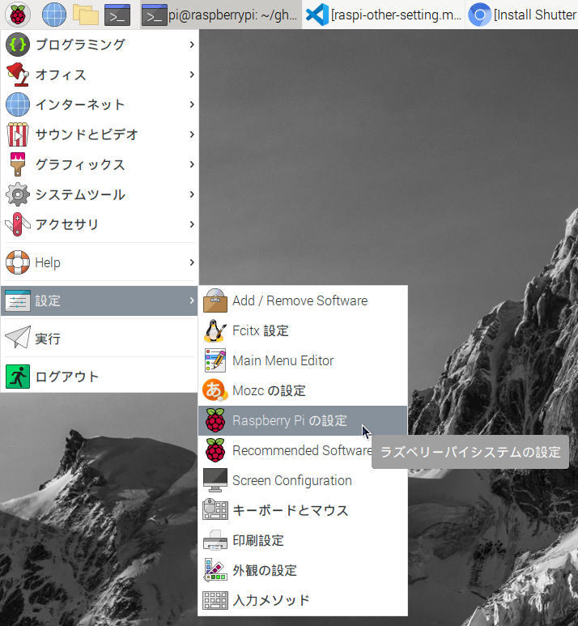

# Raspberry Pi諸々設定

##　ビデオメモリ

デフォルト設定でGPUメモリ設定が少なく、画像や動画を表示するときにもっさりしたりするので、GPUメモリをより大きな数値に設定すると改善される場合がある。

「ラスパイマーク」ー>「設定」ー>「Raspberry Piの設定」の順をクリック。



設定画面で、「パフォーマンス」のタブを開いて、GPUメモリの数値を増やします。


あまり増やしすぎると起動できなくなる場合があるので、今回は512にしてみた。

GPUメモリの欄に512と入力して、「OK」を押すと、システムの再起動が要求されるので、「はい」をクリックして再起動する。

設定数値が大きすぎで起動しない場合は、SDカードを別のマシンに挿して、config.txtを編集して、GPUメモリの設定値を小さくする必要がある。

## パスワードなしでsudoを実行できないようにする

sudoをパスワードなしで実行できるのは便利だが、間違ってシステムを壊す危険性があるので、`sudo`を実行される際にパスワードを要求されるようにする。

シェルで以下のコマンドで``
```shell
sudo nano /etc/sudoers.d/010_pi-nopasswd
```
`010_pi-nopasswd`のファイルを開いて、その中の`pi ALL=(ALL) NOPASSWD: ALL`の前に`#`を入力してコメントアウトする。


入力し終わったら、「Ctrl+X」を押して終了する。以下のように保存しますかと聞かれるので、


「Y」 => 「Enter」の順でキーボードを押して設定を保存する。
