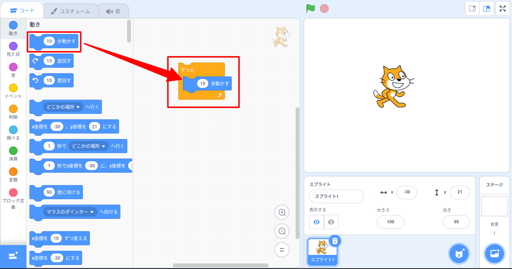
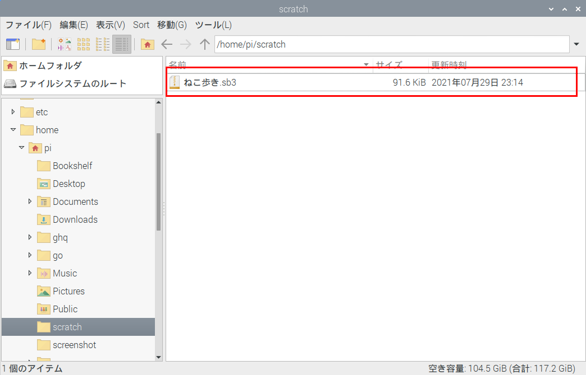

# 初めてのScratch3

Scratch(スクラッチ)はアメリカ・マサチューセッツ工科大学のメディアラボが無償で公開しているビジュアルプログラミング言語。画面上のブロックをつなぎ合わせてプログラムを作る。

スクラッチはWeb(ウェブ)で使う方法と、パソコンにオフライン版をインストールして使う方法がある。

今回はRaspberry Piにインストールしたオフライン版を使う。

ウェブで使うには、chrome、firefoxやsafari等ブラウザで https://scratch.mit.edu/ にアクセスする。

 

## 起動方法

メニューの「プログラミング」グループから「Scratch 3」をクリックして起動する。

 

## 画面の説明

Scratch 3を起動すると以下の画面が表示される。

1. メニューバー
   言語を設定したり、作成したプログラムを保存したり、コンピュータに保存されているプログラムを読み込んだり、Scratch3の基本操作などを教えてくれるチュートリアルを起動することができる。
2. 命令ブロックパレット
   スプライトに命令を与える部品
3. 命令ブロックカテゴリ
   命令を色でグループ分けしている部分
4. スクリプトエリア
   プログラムを組み立てる場所
   ブロックを並べてスプライトの動きを規定するエリア
5. ステージ
   プログラムの結果を表示する場所
6. スプライトリスト
   スプライト一覧が表示される場所
   ステージに配置されている画像をスプライトと呼ぶ。
   基本的に１つ以上のスプライトがステージ上に存在する。
7. ステージリスト
   ステージの背景を複数用意して切り替えることもできる。
   ここはその一覧が表示される場所

 

## 言語設定

メニューバーのScratch右側の地球マークをクリックして、「日本語」を選ぶ。

漢字の読めない子どもは「にほんご」を選んでひらがな環境が使える。

 

## ネコをブロック動かそう

下記画面で命令ブロックの「10歩動かす」をクリックしてみてください。

ネコをブロックで動かせたでしょうか？

次に何回もクリックしたり、
10という数値を他の数値に変えてクリックして見てください。

 

## ネコを自動的に動かそう

まずは、動かしたネコをマウスで引っ張って、ステージの真ん中まで持っていこう。

ブロックカテゴリ「制御」から「ずっと」のブロックをスクリプトエリアに持ってきて、その中に「10歩動かす」のブロックを入れてください。

その後、「ずっと」のブロックをクリックして、ネコはどうなるかを見てみよう。

しばらくしたら以下のようになっているのではないでしょうか。

ネコは右側で止まっているように見えるが、スクリプトエリアのブロックを見てください。ブロックの周りに黄色になっているのはわかる。これはプログラムが動いていることを表している。右上の赤い丸とクリックするとプログラムを止めることができる。

 

## 旗でネコが動き始めるようにしよう

プログラムを止める赤い丸の左に旗のマークがあると気付いていると思う。それをクリックすると、ネコが動き始めるようにしよう。

ブロックカテゴリ「イベント」の中から、「旗が押されたとき」のブロックを「ずっと」のブロックの上に持っていてください。

そうしたら、右上の旗マークをクリックするとネコが動き始める。

 

## 端についたら跳ね返すようにしよう

これまでのプログラムでネコは端に着いたらそこに止まっていたが、端で跳ね返るようにしよう。

ブロックカテゴリ「動き」から「もし端に着いたら、跳ね返る」のブロックを「10歩動かす」のブロックの下に置いてください。

右上の旗マークをクリックしてみてください。端に着いたら跳ね返してずっと歩き続いているね。

跳ね返るときに、ネコが逆さまになっていると気付いていると思うが、そうならないようにどうすればよいのかな？

**ヒント:** ブロックカテゴリ「動き」のブロックの中から回転方法を制御するブロックを調べてみよう。

 

## ネコの動きをもう少しリアルにしよう

これまでのプログラムはネコの様子がずっと同じで平行移動していたが、ネコの見た目を変えて走っているようにしよう。

画面左上の「コスチューム」のところをクリックしてみよう。以下のような画面が表示すると思う。

左上に見た目の違う、２つのネコの画像が見えていると思う。

それぞれ、「コスチューム１」、「コスチューム２」と呼ぶ。コスチュームは英語「costume」で、「衣服、とくに舞台衣装や時代的な衣装。」の意味だが、ここで見た目の意味だと思っていい。

この２つの画像を交互にクリックしてみてください。ネコが歩いているように見えていると思う。

この動きをプログラムで実現しよう。

ブロックカテゴリ「見た目」から「次のコスチュームにする」のブロックを「10歩動かす」と「もし端に着いたら、跳ね返る」の間に挿入してください。

終わったら、旗マークをクリックしてネコの動きをどうなっているかを確認してください。

 

## 背景を変えてみよう

画面上右下の「背景を選ぶ」ボタンをクリックしてみよう。

そうしたら、下記画面が表示される。表示されているたくさんの種類の背景から好きなものをクリックして、左上の「Back」矢印をクリックしてください。

例えば、上の図の中の「bedroom 1」を選んだとすると、ステージの背景は以下のように変わるはず。

いろんな背景を変えてみて自分の一番すぎなものにしてみてください。

 

## 作ったプログラムをファイルに保存しよう

メニューバーの「ファイル」をクリックして、「コンピューターに保存するをクリックする。

そうしたら、以下のような保存場所を設定する画面が表示される。

今回はホームディレクトリに「Scratch」というフォルダを新規作成してそこにファイルを保存するようにしたいので、右上のフォルダ作成アイコンをクリックする。

そうしたら出てきた下記画面で「scratch」を入力して、「作成」をクリック。

出来きた画面左上の「名前」欄に任意のファイル名を入力して、「保存」をクリックする。

ファイル名の「.sb3」の部分はそのままにしておいて下さい。

そうしたら、ホームフォルダに「scratch」というフォルダが生成され、その中に今回作ったプログラムのファイルが保存される。

 

## 保存したプログラムを読み込む

コンピュータに保存されているプログラムを読み込んでみよう。

メニューバーの「ファイル」をクリックして、「コンピューターから読み込む」をクリックする。

そうしたら、下記のようなファイルを開くダイアログが表示される。

ここの例では、プログラムがホームフォルダにある「scratch」というフォルダに保存されているため、「ホーム」ー>「scratch」ー>「開く」の順にクリックする。

「scratch」のフォルダの内容が表示される。

読み込みたいプログラム「ねこ歩き.sb3」をクリックして、「開く」ボタンをくりっくすると、下図のようにプログラムが読み込まれる。

