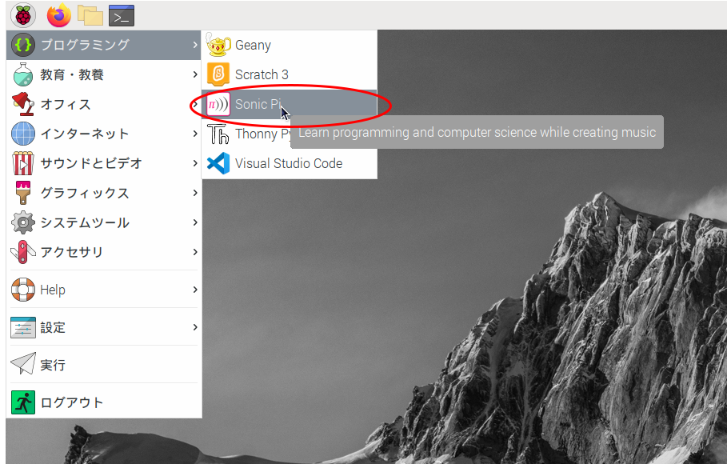
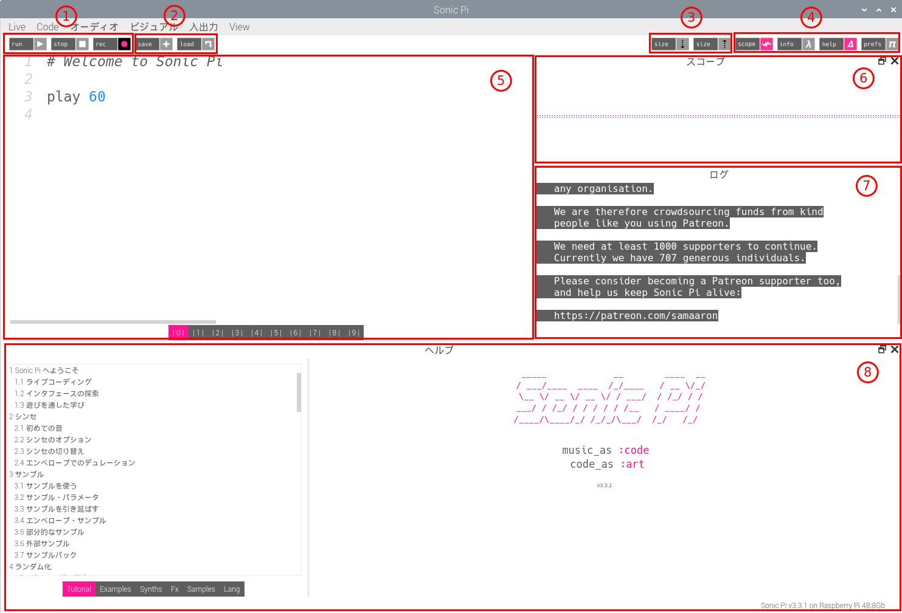
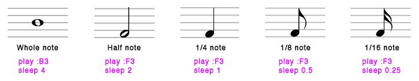
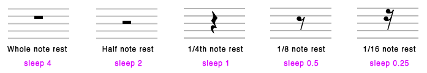
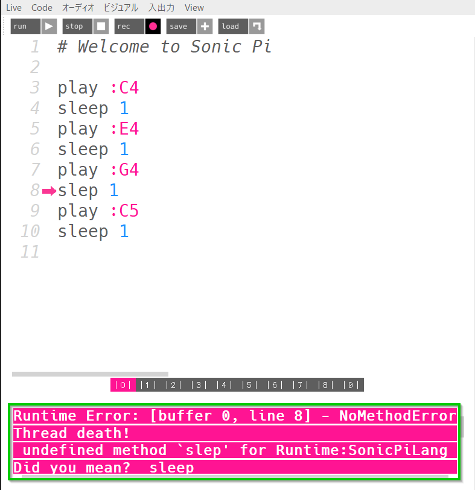

# Sonic Piでライブコーディング -- 1回目

Sonic Pi１回目の目標

- Sonic piの画面におなじみになる
- 音を出す簡単なプログラムが書ける
- 音符、リズム、テンポの基本を理解する
- プログラムを繰り返すことができる
- プログラムにエラーがあると、コンピュータが実行しなくなる事を体験する
- Sonic Piで作ったプログラムをファイルに保存できる
- ファイルに保存されたプログラムをSonic Piにロードできる
- Sonic Piでプログラムの出力を録音できる

## Sonic Piとは

音を扱うオープンソースのプログラミング環境。

- プログラムを書いて音楽を作れる
- 音楽を作りながらプログラミングを学べる

[ホームページ](https://sonic-pi.net/)

<br>

## Sonic Piデモ動画

[Music Programming Workshop with Sonic Pi](https://youtu.be/fzw3Kzyyw48)

<br>

## Sonic Pi 起動

ラズベリパイマーク ー> プログラミング ー> Sonic Piの順にクリック



<br>

## Sonic Pi 画面



1. 演奏操作
   - run
     演奏を開始する
   - stop
     演奏を停止する
   - rec
     演奏の音を録音してwavファイルに保存する
     保存されたwavファイルはほかのソフトで再生可能
2. ファイル操作
   - save
     プログラムエリアに書かれているプログラムをファイルに保存する
   - load
     ファイルに保存されたプログラムを読み込む
3. エディタフォントサイズ設定
   - size ↓
     プログラムエリアの文字サイズを小さくする
   - size ↑
     プログラムエリアの文字サイズを大きくする
4. 環境設定とヘルプ
   - scope
     演奏中に音の波形の表示/非表示スイッチ
   - info
     Sonic Pi関連情報画面表示/非表示スイッチ
   - help
     ヘルプ画面表示/非表示スイッチ
   - prefs
     Sonic Pi設定画面表示/非表示スイッチ
5. プログラムエリア
   コード(文字)を入力・編集してプログラミングを行う場所
6. スコープ
   演奏中の音の波形を表示する場所
7. ログ
   プログラム実行時の動作に関する情報を表示する場所
8. ヘルプ表示エリア
   ヘルプ画面
   チュートリアル、サンプル、シンセ/サンプル情報、プログラム命令関連様々な情報を調べることができる。

<br>

## サンプルを実行してみる

チュートリアルに付いているサンプルをプログラミングエリアにコピーして再生してみる。

例えば、

- Driving Pulse
- Blimp Zones

ここで問題：

- 繰り返されているプログラムはどこか？
- ドラムっぽいものは？
- 音符を再生している部分は？

<br>

## 音符を再生

```ruby
play 60
```

数値は音符に対応しているMIDIノート番号、音程を表している。


画像は[www.audiolabs-erlangen.de](https://www.audiolabs-erlangen.de/resources/MIR/FMP/data/C1/FMP_C1_MIDI-NoteNumbers.png)から引用。

音程は音名で指定することも可能

```ruby
play :C
```

オクターブ上とオクターブ下の音は数値をつけて表現する。

数値を書かない場合は第４オクターブが選択される。

- `play :C` と`play :C4`では同じ音が再生される
- `play :C3`では、１オクターブ下の`C`が再生される
- `play :C5`では、１オクターブ上の`C`が再生される

半音上と半音下の音を表現するには、音名に`s`と`b`を追加する。

```ruby
play :Cb4
# play :C4
# play :Cs4
```

<br>

## 同時に音を出す(コード)

複数のplayを並べると和音(コード)が再生される。

```ruby
##| play 60
##| play 64
##| play 67
play :C4
play :E4
play :G4
```

## リズムをつける

音符と和音だけでは音楽をつけれない。

時間構造をつけてリズムをつける必要がある。

Sonic Piでリズムをつけるには、`sleep`命令を使用する。

```ruby
play :C4
sleep 1
play :E4
sleep 1
play :G4
sleep 1
play :C5
sleep 1
```

`sleep`後の数値を変えてみる。

```ruby
play :C4
sleep 1
play :E4
sleep 0.5
play :G4
sleep 0.5
play :C5
sleep 1
```

`sleep`は`play`の後に、次の`play`までの待ち時間を制御する。

その後の数値は拍の数。1は1泊を意味する。

初期設定では1拍は1秒。

異なる長さの音符と休符はSonic Piでは以下のように記述する。





画像は[mehackitの資料](http://sonic-pi.mehackit.org/exercises/ja/01-introduction/02-play-a-melody.html)から引用

<br>

## テンポを変えてみる

初期設定では1拍1秒なので、演奏のテンポは60bpm。

演奏のテンポは`use_bpm 数値`命令で変えることができる。

```ruby
use_bpm 120

play :C4
sleep 1
play :E4
sleep 0.5
play :G4
sleep 0.5
play :C5
sleep 1
```

`use_bpm`後の数値を変えてみてください。

<br>

## 演奏を繰り返す

演奏を繰り返す演奏するには、プログラムを`loop do ... end`で囲む。

```ruby
use_bpm 120

loop do
  play :C4
  sleep 1
  play :E4
  sleep 0.5
  play :G4
  sleep 0.5
  play :C5
  sleep 1
end
```

上記コードでは、メロディーは無限に繰り返される。

繰り返す回数を設定するには、`loop`を`数値.times`に差し替える。

```ruby
use_bpm 120

4.times do
  play :C4
  sleep 1
  play :E4
  sleep 0.5
  play :G4
  sleep 0.5
  play :C5
  sleep 1
end
```

<br>

## プログラムエラー

```ruby
play :C4
sleep 1
play :E4
sleep 1
play :G4
slep 1
play :C5
sleep 1
```

上のプログラムをSonic Piのプログラムエリアにコピーして実行して見てください。

４つの音符を鳴らしたいのに、3つの音しか鳴らないはず。それに、画面の下にピンクのメッセージが表示されている。



上記プログラムのエラーを修正してみてください。

<br>

## 本日のまとめ

### 今日勉強したこと

- Sonic 画面
- `play`で音符を再生
- `sleep`でリズムをつける
- `use_bpm`でテンポを変える
- `loop do ... end` や `n.times do ... end`で繰り返す
- エラーを修正

### 宿題

自分のメロディーを作って発表してください。

## 参考資料

文字資料：

- Sonic Pi ヘルプ
- [Sonic Piでクリエイティブ・プログラミング](http://sonic-pi.mehackit.org/index_ja.html)

Youtube 動画：

- [Sonic Piチュートリアル](https://www.youtube.com/playlist?list=PL-XQgqmfHlqhiohB1PQiBq0gfvbJBjfuh)
- [Introduction to Sonic Pi - The Complete Series! ](https://www.youtube.com/playlist?list=PLaitaNxyd8SHvTQjRGnMdKLsARXW7iYyp)
