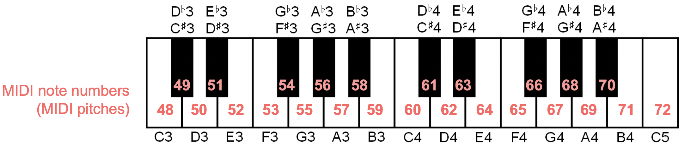

# Sonic Piでライブコーディング

Sonic Pi１回目の目標

- Sonic piの画面におなじみになる
- 音を出る簡単なプログラムが書ける
- 音符、リズム、テンポの基本を理解する
- プログラムにエラーがあると、コンピュータが実行しなくなる事を体験する
- プログラムを繰り返すことができる
- Sonic Piで作ったプログラムをファイルに保存できる
- ファイルに保存されたプログラムをSonic Piにロードできる
- Sonic Piでプログラムの出力を録音できる

## Sonic Piとは

音を扱うオープンソースのプログラミング環境。 

- プログラムを書いて音楽を作れる
- 音楽を作りながらプログラミングを学べる

[ホームページ](https://sonic-pi.net/)

<br>

## Sonic Piデモ動画

[Music Programming Workshop with Sonic Pi](https://youtu.be/fzw3Kzyyw48)

<br>

## Sonic Pi 起動

ラズベリパイマーク ー> プログラミング ー> Sonic Piの順にクリック


<br>

## Sonic Pi 画面

### Sonic Pi 画面の説明


1. 演奏操作
   - Run
   - Stop
   - Rec
2. ファイル操作
3. エディタフォントサイズ設定
4. 環境設定とヘルプ
5. コーディングエリア
6. スコープ
7. ログ
8. ヘルプ表示エリア

### サンプルを実行してみる

チュートリアルに付いているサンプルをプログラミングエリアにコピーして再生してみる。

例えば、
-  Driving Pulse
-  Blimp Zones

ここで問題：
- 繰り返されているプログラムはどこか？
- ドラムっぽいものは？
- 音符を再生している部分は？

<br>

## 音符を再生してみる

```ruby
play 60
```

数値は音符に対応しているMIDIノート番号



画像は[www.audiolabs-erlangen.de](https://www.audiolabs-erlangen.de/resources/MIR/FMP/data/C1/FMP_C1_MIDI-NoteNumbers.png)から引用。

<br>

## プログラムエラー

以下のプログラムをSonic Piのプログラムエリアにコピーして実行するとどうなるか？

```ruby
play 50
sleep 0.5
play 60
slep 0.5
play 70
sleep 1
```

<br>

## コード

```ruby
play 60
play 64
play 67
```

### メロディ


## 他の参考資料

文字資料：

- [Sonic Piでクリエイティブ・プログラミング](http://sonic-pi.mehackit.org/index_ja.html)
- Sonic Pi チュートリアル

Youtube 動画：

- [Sonic Piチュートリアル](https://www.youtube.com/playlist?list=PL-XQgqmfHlqhiohB1PQiBq0gfvbJBjfuh)
- [Introduction to Sonic Pi - The Complete Series! ](https://www.youtube.com/playlist?list=PLaitaNxyd8SHvTQjRGnMdKLsARXW7iYyp)

